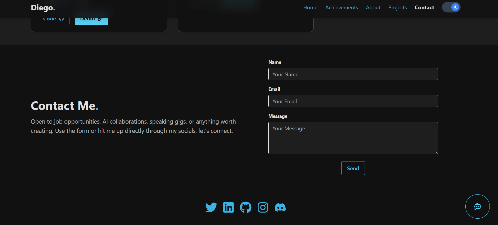
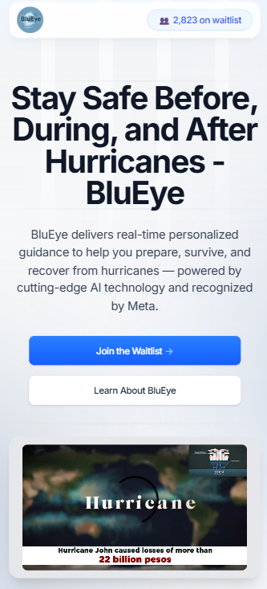
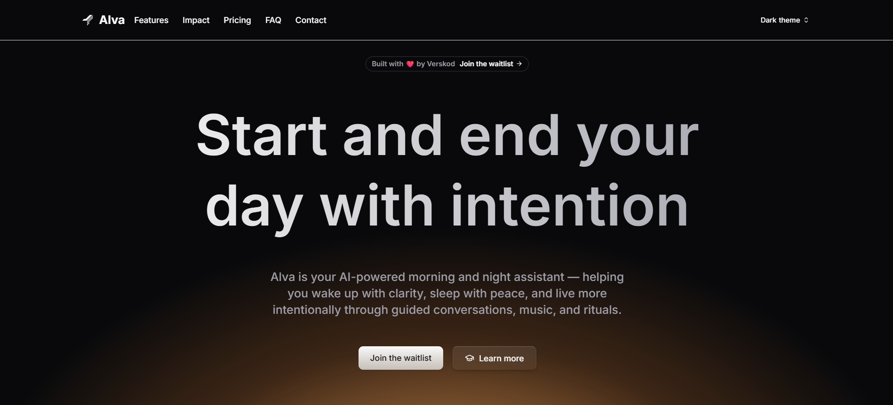

## 🚀 Project Overview

Welcome to my personal developer portfolio — a modern, interactive space built to showcase my work, skills, and professional journey.

This portfolio is more than just a website — it's a fully functional product featuring real backend logic, an AI-powered assistant, and a selection of impactful projects I have built or contributed to. My goal is to demonstrate what I can do as a full-stack developer with a strong focus on AI integration.

Im currently seeking a web developer role (frontend or AI-focused), and this portfolio reflects both my technical ability and my drive to create real-world solutions.

## 💡 Standout Features

- **🧠 AI-Powered Portfolio Assistant**  
  Integrated with a FastAPI backend and OpenRouter to answer real-time questions about my background, projects, and skills — enhancing interactivity and recruiter engagement.

- **🏆 Award-Winning Projects**  
  Includes projects like **BluEye**, winner of Meta's Llama Impact Hackathon and recipient of a **$100,000 grant**, focused on hurricane prevention using AI and weather APIs.

- **⚙️ Full-Stack Development**  
  Built with React, TailwindCSS, and FastAPI — demonstrating both frontend polish and backend logic in production-ready code.

- **🌐 Deployed & Scalable**  
  Hosted with Vercel (frontend) and Railway (backend), showcasing real-world deployment practices and live AI functionality.

- **🔥 Clean, Responsive Design**  
  Mobile-first UI with smooth interactions, dark mode, and component-based structure designed for usability and speed.
  
  
## 🛠 Tech Stack

This portfolio combines modern frontend technologies with real backend logic and AI integration:

### 🧩 Frontend
- **React** – Component-based UI with reusable logic
- **Tailwind CSS** – Utility-first styling for a clean, responsive design

### 🔧 Backend
- **FastAPI** – Lightweight, high-performance Python framework for handling AI requests
- **OpenRouter API** – Flexible access to multiple large language models including GPT, Mistral, and Claude

### ☁️ Deployment
- **Vercel** – Frontend hosting with continuous deployment
- **Railway** – Backend hosting for API endpoints and AI assistant logic

### 🧠 Additional Tools
- **Lucide React** – Icon system for UI components
- **React Icons** – Technology icons for project cards

## 🤖 AI Integration

This portfolio features a built-in conversational assistant powered by large language models (LLMs), showcasing real backend logic and prompt engineering.

- **FastAPI Backend** – Handles user questions and communicates with the language model via a structured API endpoint (`/ask`), including validation, error handling, and request optimization.

- **OpenRouter API** – Connects to models like GPT-3.5, Mistral 7B, and Claude, with easy switching for different providers depending on use case.

- **Custom Prompting Logic** – Dynamically constructs prompts to give the AI relevant context about my experience, projects, and skills, ensuring accurate and helpful answers.

- **Frontend Integration** – Responses are streamed back and rendered in a clean React-based UI, with support for loading states and message history.

This integration demonstrates not just AI usage, but also practical API handling, prompt design, and UI-to-backend communication — essential skills for real-world AI-powered applications.

## 🖼️ Featured Projects

### 🌪️ BluEye – AI-Powered Hurricane Prevention App  
**🏆 Winner of Meta’s Llama Impact Hackathon · Recipient of the $100,000 Llama Impact Grant**

BluEye is an AI-powered mobile application designed to reduce disaster risk by providing real-time, personalized hurricane guidance. It uses the Llama 3.2 model and weather APIs to assist users before, during, and after a storm based on their location and needs.

- Built with **React Native**, **Llama 3.2**, and **OpenWeather API**
- Personalized chatbot for prevention, emergency response, and recovery actions
- Integrates geolocation and disaster prevention best practices into a seamless UX

💡 **Why it matters:**  
BluEye won **Meta’s Llama Impact Hackathon (Continental Winner)** and was selected as one of the most socially impactful AI projects in the Americas. It received the **$100,000 Llama Impact Grant** to continue development, placing it among the top AI-for-good solutions sponsored by Meta in 2024.

---

### ⏰ Alva – Conversational AI Alarm and Sleep Assistant  
**Cutting-edge voice-first app built with open-source AI models**

Alva is a React Native app that simulates voice conversations to help users wake up and wind down intentionally. It uses open-source speech models to deliver calming, motivational voice experiences that adapt to the user’s mood, habits, and preferences.

- Built with **React Native** and **open-source AI voice models**
- Voice-first experience simulating a natural morning/night interaction
- Includes mood check-ins, playlists, mantras, and personalized voice guidance
- Designed to support mental clarity, habit-building, and better sleep hygiene

## 📸 Screenshots & Demos

Here are a few previews of the portfolio and featured projects in action:

### 💻 Portfolio with AI Assistant

### 🌪️ BluEye – Personalized Hurricane Prevention - Landing Page

### ⏰ Alva – Conversational Voice Alarm - Landing Page

> 📌 *Click on any image to view it in full size (in supported platforms)*

These visuals demonstrate working logic, mobile responsiveness, and AI-driven UX — not just static UI.

## 👨‍💻 About Me

I'm a bilingual full-stack developer with a strong focus on AI integration and real-world product development. I specialize in building modern, user-focused web and mobile applications using tools like React, FastAPI, and LLM APIs.

- 🧠 Co-founder of AI and productivity-focused startups (BluEye, COMS, Verskod)
- 🏆 Winner of Meta's Llama Impact Hackathon and $100K Impact Grant recipient
- 🎤 Speaker and hackathon contributor at tech events across LATAM
- 💼 Actively seeking a full-time role as a frontend or AI-focused web developer

I’m passionate about solving real problems with practical, intelligent solutions — and I’m ready to bring that energy to your team.

